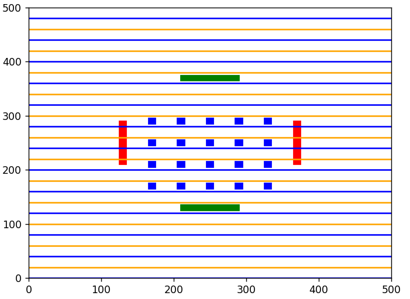

# Quadratic_Placement

The size of SRAM and Macro blocks can be varied in main module.

The minimum spacing rules is set to 30.

The distance, d between VDD(yellow) and VSS(blue) is 15.

Before quadratic placement:

After quadratic placement:

